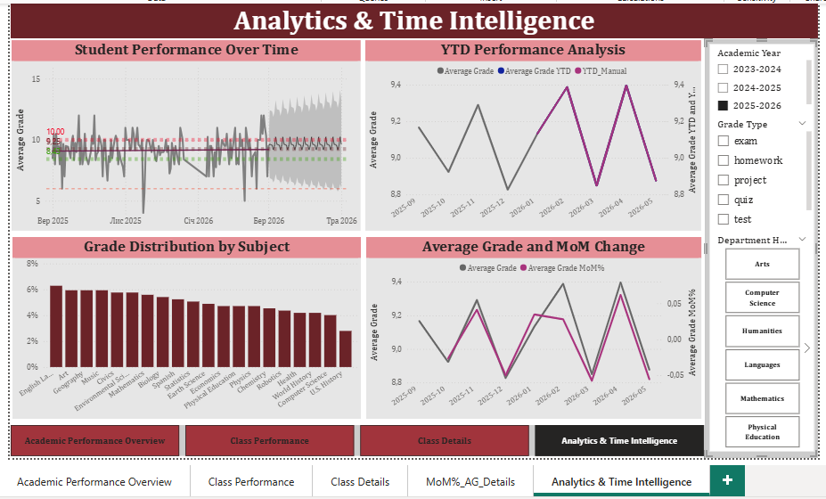

# Student Performance Analysis

## About the project

This project presents a Power BI dashboard designed to analyze student academic performance and assessment results. 

 ## Analysis

The dashboard provides an analysis of students' grades across different types of assessments, including tests, projects, exams, and homework.

### The analysis includes:

- Overall average grade across all assessments
- Average grades by assessment type
- Average grade distribution by subject
- Average grades by subject and class
- Distribution of negative grades by assessment type
- Monthly changes in student grades
- Student performance trends, MoM changes, YTD analysis, and a two-month forecast

## Interactive filters

The dashboard includes interactive filters by:

- Academic year
- Grade type
- Department hint

## Tools
   
- Power BI
- Power Query
- DAX

Power BI file: Student_Performance_Analysis.pbix
Student_Performance_Analysis.pbix
